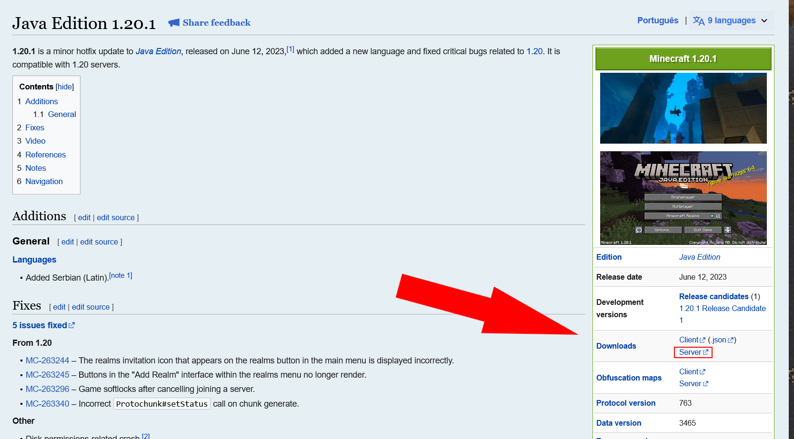

# Different methods of making a Minecraft server

There are many ways to create a Minecraft server to play with other people. Here I will cover some of the best methods.

## Hosting it locally on your pc

I would say this is the best free method, but as always, there are disadvantages.

* Advantages:
 * Can stay online 24/7 as long as you leave your computer on 24/7.
 * Ping is near 0 for you and friends that live near you.
* Disadvantages:
 * 

### Tutorial

For Minecraft Java Edition, you need to choose between a Vanilla server, a modded server or a server with plugins.

#### Vanilla server

1. Download server.jar from Minecraft.net.\
 * 1.1 Visit https://www.minecraft.net/pt-br/download/server and click "Download minecraft_server.1.21.4.jar"\
  * 1.1.1 That website only has the server.jar of the newest version. If you want to make a server on an older version, go to [minecraft.wiki](https://minecraft.wiki) and search for the version you want. For examble, [1.20.1](https://minecraft.wiki/w/Java_Edition_1.20.1). On the right, there should be a "Downloads" section. Click on "server".\
  
  
2. 