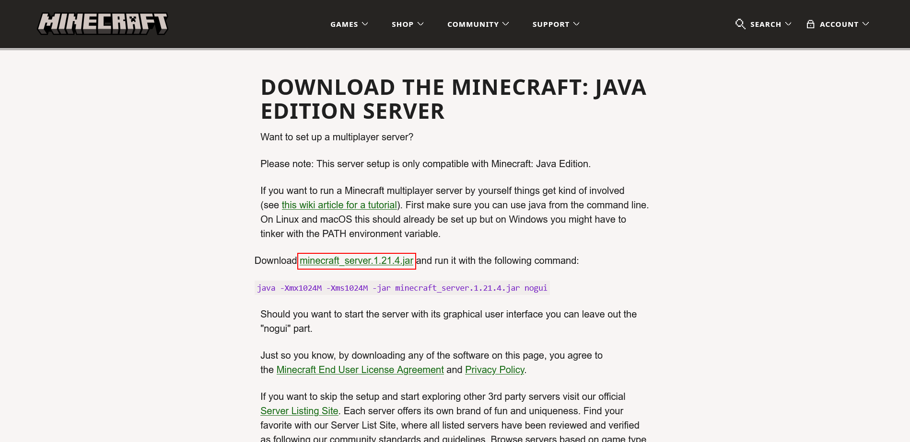

# Different methods of making a Minecraft server

There are many ways to create a Minecraft server to play with other people. Here I will cover some of the best methods.

## Hosting it locally on your pc

I would say this is the best free method, but as always, there are disadvantages.

* Advantages:
  * Can stay online 24/7 as long as you leave your computer on 24/7.
  * Ping is near 0 for you and friends that live near you.
* Disadvantages:
  * 

### Tutorial

For Minecraft Java Edition, you need to choose between a Vanilla server, a modded server or a server with plugins.

#### Vanilla server

1. Download server.jar from Minecraft.net.
   * Visit https://www.minecraft.net/download/server and click "Download minecraft_server.1.21.4.jar"
 
     * That website only has the server.jar of the newest version. If you want to make a server on an older version, go to [minecraft.wiki](https://minecraft.wiki) and search for the version you want. For examble, [1.20.1](https://minecraft.wiki/w/Java_Edition_1.20.1). On the right, there should be a "Downloads" section. Click on "server".\
 
  
2. Prepare the server folder.
   * After downloading the file, find it on your computer and copy it. Now, make a folder somewhere easy to access. For example, inside a folder named "Minecraft Server" inside your Documents folder.
   * Paste the server.jar file you copied earlier in this folder.

3. Create the start.bat file
    Now, right click and "Create new" > "Text file".\
    Open that file and write:
```
java -Xmx2048M -Xms1024M -jar server.jar
```
    Save by clicking "File" > "Save" or simply Ctrl + S.
    > [!TIP]\
    > You can adjust how much ram you allocate to the server by changing the numbers. For 2GB, leave it as is. For 4GB, replace ```-Xmx2048M``` with ```-Xmx4096M```. I would say allocate at least 2GB. And obviously don't allocate too much.

   Make sure you can see the file extension, like .jar and .txt. If you can't, click on View, and turn on Filename extensions.\
   Name that text  you just created something like "start.bat". It has to have a .bat extension, or else this won't work.\

4. Start the server

   Double click the bat file to start the server. A few new files will appear in your server folder. When everything is done, you should see a eula. txt. Open it, swap ```eula=false``` to ```eula=true```. Save the changes, and start the server again. New folders and files will be created and a GUI will appear.